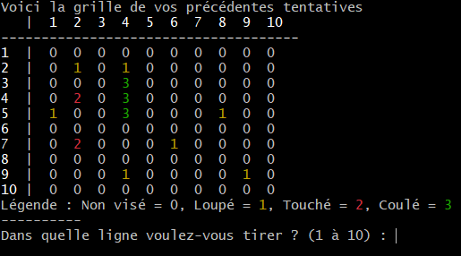

___

# Battleships

**Small Battleships game with Python**

## Features

- 2 players game | 1 VS 1
- 1 player game | In this mode, player must sink all computer' ships in a minimum of strokes.
- Manual ships placement
- Colors depending of the state of the cell

## Installation 

- Clone the repository :

```sh
git clone https://github.com/thomas-cvt/bataille-navale.git
```

- Create Docker image :

```sh
docker build -t bataille-navale .
```

- Run the container :

```sh
docker run -it bataille-navale
```

___

# Bataille Navale

**Petit jeu de bataille navale en Python.**

## Fonctionnalités

- Partie 2 joueurs | 1 VS 1
- Partie 1 joueur contre l'ordinateur | Dans ce mode, le joueur est seul à tirer et doit couler tous les bateaux adverses avec le moins de coups possibles
- Placement des bateaux manuellement
- Couleur en fonction de l'état de la case

## Installation 

- Clôner le dépot :

```sh
git clone https://github.com/thomas-cvt/bataille-navale.git
```

- Créer l'image Docker :

```sh
docker build -t bataille-navale .
```

- Lancer le conteneur :

```sh
docker run -it bataille-navale
```